# The Harness

The harness is the system that lets an AI agent produce correct, high-quality code consistently. It has **five pillars**: four that the agent works through, plus the discipline that holds them together.

## Diagram

```mermaid
flowchart LR
  subgraph FW["Flywheel"]
    direction LR
    F1[Reviewer<br>gives feedback] --> F2[Update<br>rule file] --> F3[Reload &<br>re-apply]
  end

  subgraph GD["Guidance"]
    direction TB
    G1["CLAUDE.md /<br>HARNESS.md"]
    G2[".claude/rules/"]
  end

  subgraph WF["Workflows"]
    direction TB
    W1[Skills<br>TDD, delivery]
    W2[Agents<br>Review, refactor, CI]
    W3[Commands<br>Pre-commit checks]
  end

  subgraph GR["Guardrails"]
    direction TB
    R1[lint]
    R2[test]
    R3[type-check]
  end

  CB["Codebase<br>(discipline)"]

  FW -->|improves rules every review| GD
  GD -->|shapes what the agent writes| WF
  WF -->|runs checks before commit| GR
  GR -->|failures trigger fixes| WF
  GR -->|pass/fail informs review| FW
  WF -->|writes code that becomes the example| CB
  CB -->|agent learns from what it reads| WF
```

## Pillars at a glance

| Pillar | What it does |
|---|---|
| **Guidance** | `CLAUDE.md` and rules in `.claude/rules/` — what to write before writing |
| **Guardrails** | Lint, tests, type-checks the agent runs and won't bypass |
| **Workflows** | Agents, commands, skills — institutional knowledge as runnable procedures |
| **Flywheel** | Reviews update rules; rules shape the next conversation |
| **Discipline** | Practices that keep the others fresh — debt maps, boy-scout rule, harness health |

---

## 1. Guidance

**What:** the prose the agent reads before writing a single line. Project context, design principles, security expectations, commit rules — everything that shapes *what to write* before it gets written.

**Includes:**
- `CLAUDE.md` — project context, layout, commands, change-approval flow.
- `HARNESS.md` — this file. The canonical definition of the pillars; the rest of the harness points back to it.
- `.claude/rules/*.md` — behavioral rules. Some always-loaded, some path-scoped (auto-load only when touching matching files).
- `.claude/features/*.md` — on-demand domain context (entities, endpoints, gotchas) the agent reads when exploring a feature. Not auto-loaded.
- `GLOSSARY.md` — ubiquitous domain vocabulary with aliases-to-avoid.

**Interacts with:**
- **Flywheel** updates Guidance every time a review surfaces a pattern.
- **Workflows** read Guidance to decide what the agent should produce.

## 2. Guardrails

**What:** the automated checks the agent runs and refuses to bypass. Lint, type-check, tests — anything a machine can verify mechanically.

**Includes:**
- The project's lint, test, and type-check commands.
- Pre-commit hooks that run them.
- CI as a backstop, not a substitute.

**Interacts with:**
- **Workflows** run Guardrails before every commit.
- Guardrail failures **trigger fixes** in Workflows.
- Guardrail outcomes **inform reviews** in Flywheel — a check that keeps catching the same issue is a candidate for a new rule.

## 3. Workflows

**What:** institutional knowledge encoded as runnable procedures. The agent invokes a workflow rather than reinventing a process every time.

**Includes:**
- `.claude/agents/*.md` — isolated, often read-only analyses (security review, refactor review, CI diagnosis).
- `.claude/commands/*.md` — single-step utilities (pre-commit verification, status checks).
- `.claude/skills/*/SKILL.md` — multi-phase workflows (TDD, bug fixes, feature delivery).

**Interacts with:**
- Reads **Guidance** to decide what to produce.
- Runs **Guardrails** before declaring done.
- Reads from and writes to the **Codebase**.

## 4. Flywheel

**What:** the feedback loop that turns one-off reviews into permanent shifts in agent behavior. The flywheel is what makes the harness compound over time.

**Includes:**
1. Reviewer gives feedback (a comment, a `/learn` invocation, a CI failure pattern).
2. Update the relevant rule file in `.claude/rules/`.
3. Reload it and re-apply. Next conversation starts with the new rule.

**Interacts with:**
- Driven by **Guardrail** outcomes and human review findings.
- Output: improved **Guidance** that shapes every future Workflow run.

## 5. Discipline

**What:** the practices that keep the other four fresh. The harness is only as strong as the code it governs and the rules it carries — both decay without active maintenance.

**Includes:**
- The codebase itself — every file is either an example the agent learns from or a counterexample that teaches the wrong thing.
- The boy-scout rule — touch a file, leave it cleaner.
- Harness-health practices — debt maps, stale-rule checks, periodic audits.

**Interacts with:**
- Governs the **Codebase** that all other pillars touch.
- Without it, rules go stale, workflows accumulate cruft, and the agent drifts back to whatever pattern it last saw most often.
